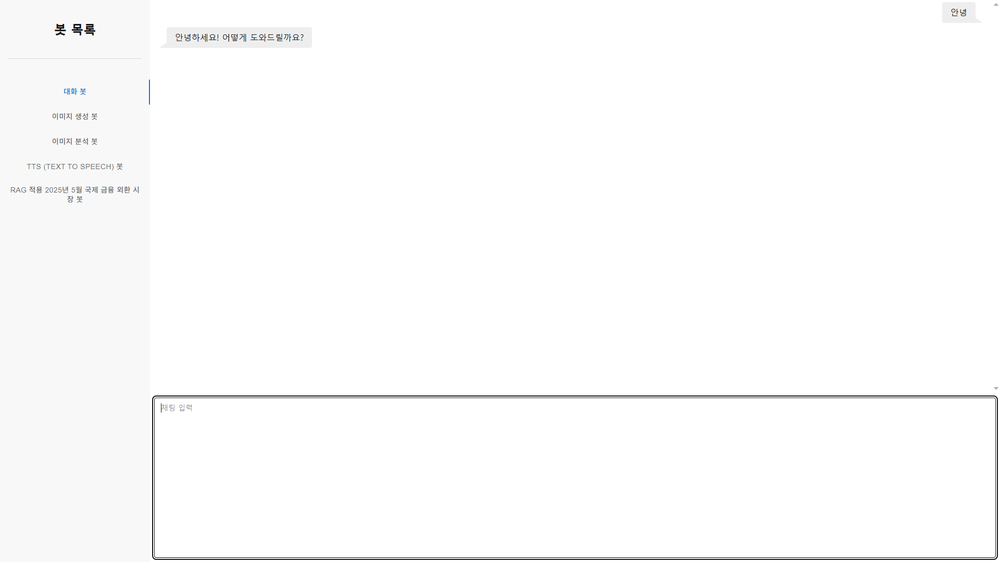
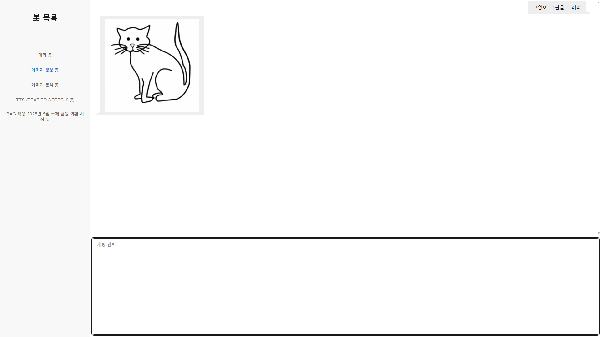
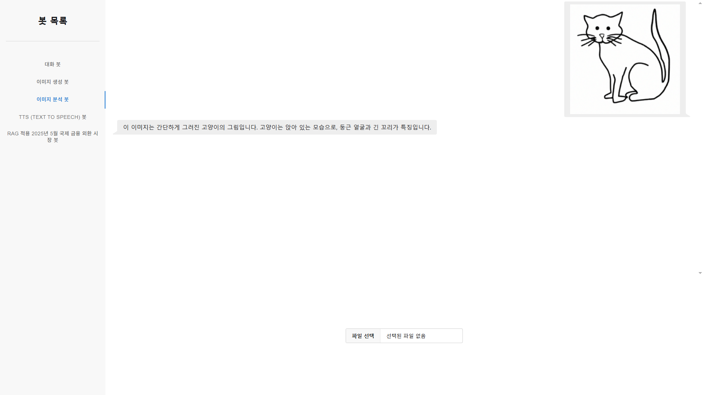
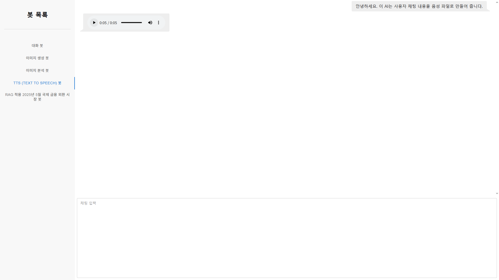
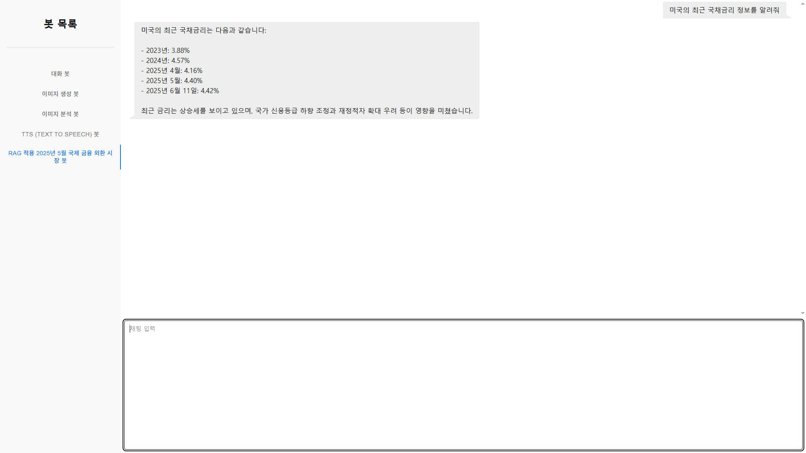

# 프로젝트 설명

URL: https://kimjr.shop:8443/

- 프로젝트 주제
  - Spring AI를 활용해 OpenAI와 통신하여 사용자에게 채팅, 이미지 생성 및 설명, TTS, RAG를 적용한 환율 동향 AI와 채팅

- 프로젝트 인원
  - 김재력 (기획, 설계, 백엔드, 프론트, 테스트 및 배포)

- 프로젝트 환경
    - OS : Ubuntu Linux (Docker Container)
    - Database : Postgres(PGvector)
    - Back-end : Spring Boot 3.5.3, Java 21, Spring AI, OpenAI
    - Front-end : React 19.1.8

- RAG에 사용된 데이터 출처
  - 출처: 한국은행 보도자료, “2025년 5월 이후 국제금융·외환시장 동향”, http://www.bok.or.kr
  - 다운로드 링크 : https://www.bok.or.kr/portal/bbs/B0000502/view.do?nttId=10091901&searchCnd=1&searchKwd=%EA%B5%AD%EC%A0%9C%EA%B8%88%EC%9C%B5&depth2=200038&depth3=201263&date=&sdate=&edate=&sort=1&pageUnit=10&depth=201263&pageIndex=1&programType=newsData&menuNo=201265&oldMenuNo=201263

## 주요 기능 및 프로세스

- 일반 채팅 AI (채팅 입력 후 엔터 버튼)

- 이미지 생성 AI (채팅 입력 후 엔터 버튼)

- 이미지 설명 AI (이미지 파일 업로드)

- Text to speech AI (채팅 입력 후 엔터 버튼)

- 2025년 5월 이후 국제 금융 외환 시장 동향 PDF 자료를 토대로 RAG를 적용한 AI (채팅 입력 후 엔터 버튼)
